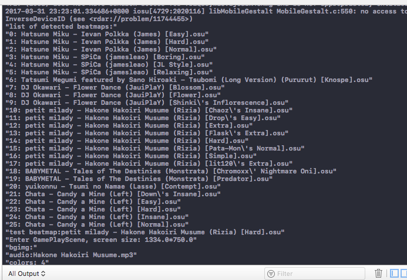
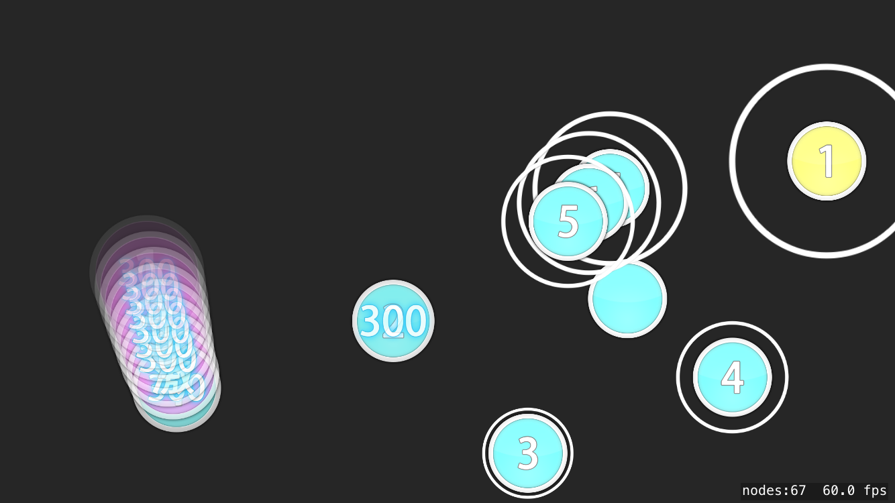

## iosu!
### Introduction
This is an ios port of the rhythm game [osu!](https://osu.ppy.sh). It is written in Swift based on [SpriteKit](https://developer.apple.com/spritekit/) framework. **It is just for fun**. So don't expect that I can make it full functional in a short time. Most importantly, I'm using a hackintosh for developing. So if it stops working, I cannot continue developing until it is fixed. Also, I don't have much time to spend on this project. But you can still watch the progress. It will be great if you can join and help me make it work.
### What has been done
 - Scan beatmaps imported by iTunes
 - Decode .osu file (partly)
 - Timing
 - Draw Plain HitCircle
 - Draw HitCircle in Slider
### How to use
1. Install the latest version of XCode.
2. Compile and install this project on your device **(DO NOT USE SIMULATOR!)** .
3. Import beatmaps via iTunes(as shown below).

4. Run the application from XCode and notice the console output(as shown below).

5. Change **testBMIndex** in **GamePlayScene.swift** to the index number of beatmap in the console output that you want to test.
6. Compile and run again on your device.
### Notice
1. Currently there is no handle for touch input, so what you can see is just a demo.
2. I only have an iPhone6s to test, so it may render terribly on devices with different resolutions.
3. If the framerate drops under 10, the timing will be inaccurate. So do not try to run it in the simulator. If that happens on your device, maybe you can consider update it because of low performance.
4. I have modified the SpriteKitEasingSwift framework to meet the need of osu! storyboard. So please **DO NOT** use the github version or run 'pod install' in order to prevent compile error.
5. I'm new to iOS development, Swift and SpriteKit. And I don't like to insert a lot of comments. So please tolerate my awful code.
### Screenshot

### Credit
 - [osu!](https://osu.ppy.sh)
 - [osu-parser](https://github.com/nojhamster/osu-parser)
 - [SpriteKitEasingSwift](https://github.com/craiggrummitt/SpriteKitEasingSwift)
 - [Stack Overflow](http://stackoverflow.com)
 - [Apple Developer Documentation](https://developer.apple.com/reference/)
