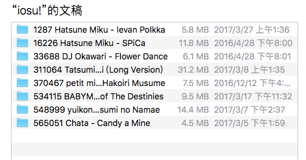
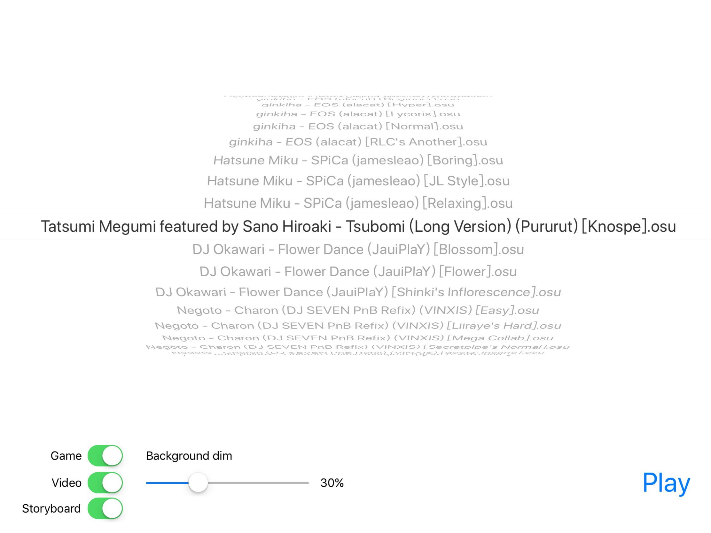
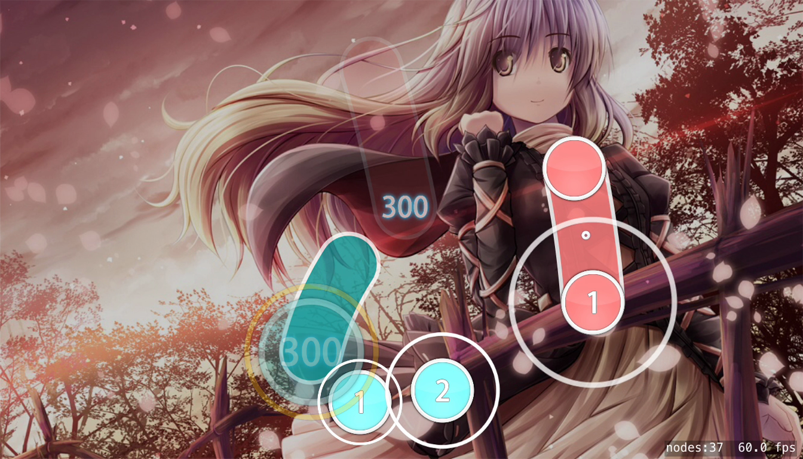
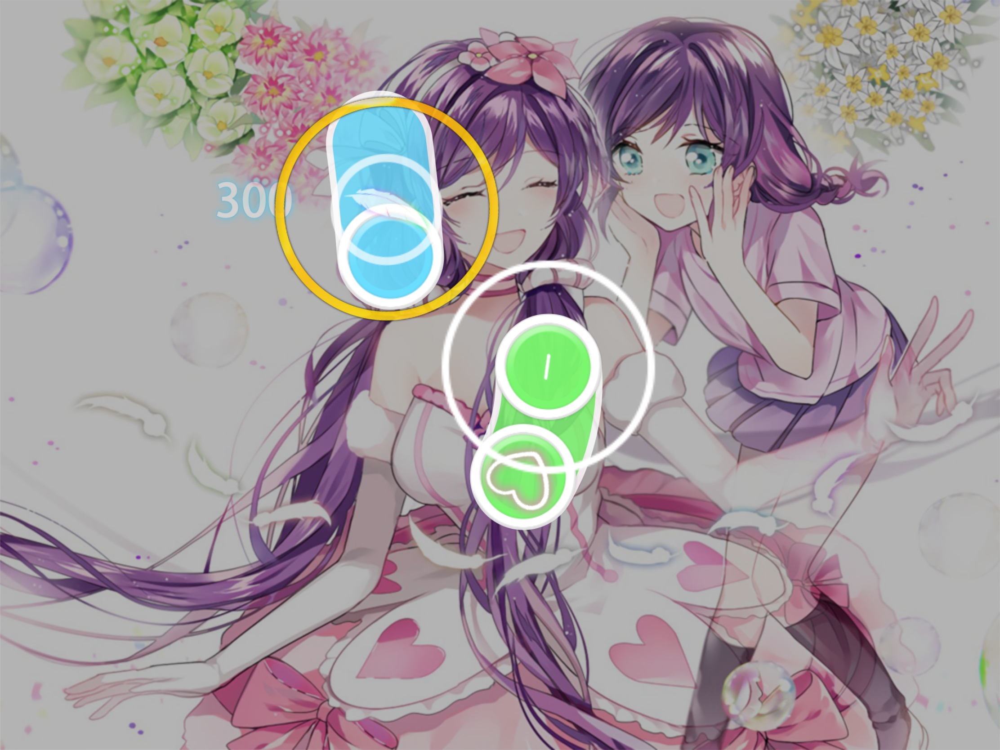
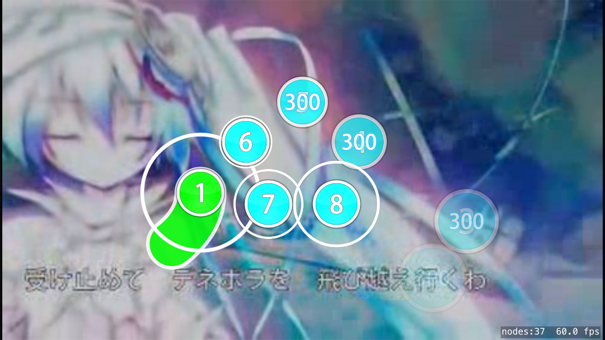
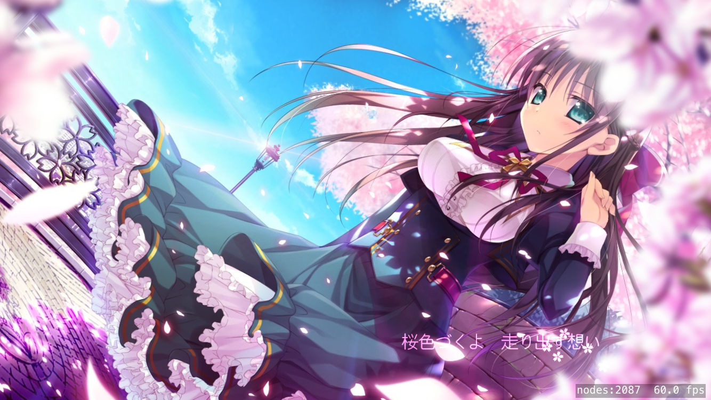
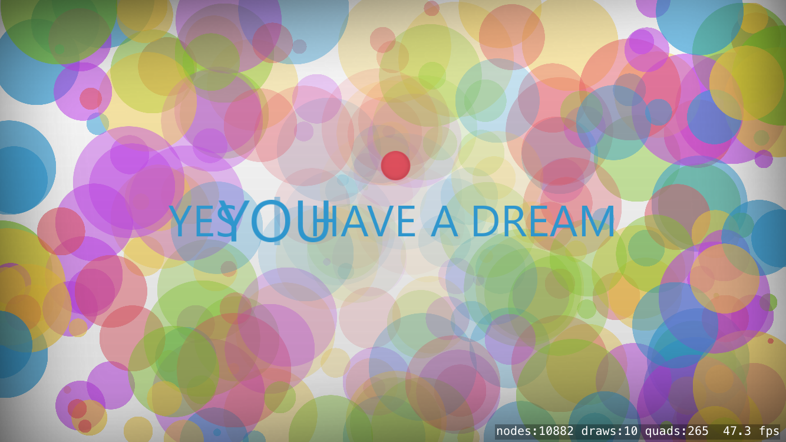
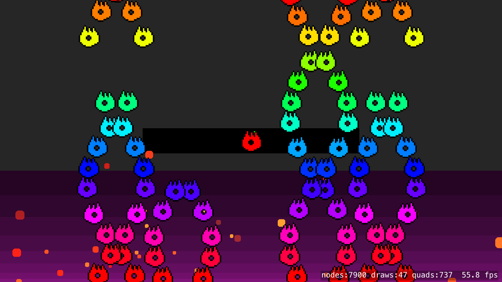

# iosu!

[](https://travis-ci.org/imxieyi/iosu)

This project is currently (not totally) suspended due to lack of time.

## Introduction
This is an ios port of the rhythm game [osu!](https://osu.ppy.sh). It is written in Swift based on [SpriteKit](https://developer.apple.com/spritekit/) framework. **It is just a hobby project for fun**. So don't expect that I can make it full functional in a short time.

## Demo Video (Game+Storyboard)
[https://youtu.be/RjuJyxciYkg](https://youtu.be/RjuJyxciYkg)

## What has been done
 - Scan beatmaps imported by iTunes
 - Decode .osu file (partly)
 - Timing with Quartz
 - Render background image & Background dim
 - Draw Plain HitCircle & Judge
 - Draw Sliders & Judge
 - **Play with backgound video**
 - **Play with StoryBoard**
 - **Play with skin in beatmap bundle**

## About UI design
The sketch file of the UI design is available [here](https://github.com/imxieyi/iosu/blob/master/assets/ui_design.sketch). The implementation is available at [iosu_ui](https://github.com/imxieyi/iosu_ui/tree/master). This project also includes database and thumbnial cache implementation.

## About default skin
According to the licence of [osu! default skin](https://osu.ppy.sh/forum/t/129191), the skin derived from osu! cannot be used here. So the skin used in this project is designed from scratch. All of the source files can be found under [assets/](https://github.com/imxieyi/iosu/tree/master/assets). In the future sound effects will also be replaced in order to prevent possible violations.

## Compilation
1. Install the latest version of XCode.
2. Install [CocoaPods](https://cocoapods.org/).
3. Run the following commands:
```bash
git clone https://github.com/imxieyi/iosu.git
cd iosu
pod install
```
4. Open iosu.xcworkspace in the project directory.
5. Build.

## Installation Through Cydia Impactor (Not recommended) (iOS 10.0+ required)
1. Download [Cydia Impactor](http://www.cydiaimpactor.com/).
2. Download latest [ipa artifact](https://git.imxieyi.com/xieyi/iosu/tags) from my personal gitlab server. (Direct link to ipa file: [https://git.imxieyi.com/xieyi/iosu/-/jobs/artifacts/v0.3.1/download?job=archive_project](https://git.imxieyi.com/xieyi/iosu/-/jobs/artifacts/v0.3.1/download?job=archive_project))
3. Connect your iDevice and run Cydia Impactor.
4. Drag .ipa file to Cydia Impactor window.
5. Input your Apple ID info.
6. Wait until it finishes.

## Import Beatmap


Both osu and osb files should be contained in directories shown in the iTunes. Directly importing directories in `Songs` on your PC (can be found in osu! installation path) should work fine.

## Notice
0. This project is still at **super early stage**, there are plenty of bugs among the whole application. So don't worry if it crashes constantly on your device. If you want to report, please attach **the link to the beatmap on [osu.ppy.sh](https://osu.ppy.sh/)** while creating an issue.
1. Currently there is no database, so please do not import too many beatmaps.
2. **It's okay** to play a beatmap with too complicated storyboard as background now. However due to thread synchronization issue, unused SKNodes will not be released during gameplay. This would result in more memory usage depending on beatmap and storyboard.
3. ~~The patched PlaySoundFileNamed function has some bugs that may crash the application, I'm still finding the solution.~~ (should have been fixed in 43e862)
4. I have an iPhone6s and an iPad Pro 10.5 to test, so it may works well on all iDevices.
5. If the framerate drops under 10, the timing will be inaccurate. So do not try to run it in the simulator. If that happens on your device, maybe you can consider update it because of low performance.
6. I have modified the SpriteKitEasingSwift framework to meet the need of osu! storyboard. The [modified version](https://github.com/imxieyi/SpriteKitEasingSwift) can also be installed by CocoaPods.
7. With the help of image buffer, you can load any complicated storyboard with acceptable memory usage. **But be sure to correct storyboard image paths because in Unix-like system file name is case sensitive.** Also, there are still some bugs in the render and processor. But in most of the time it works well.
8. StoryBoard support for [Cheat Sheet](https://osu.ppy.sh/wiki/Storyboard_Scripting/Cheat_Sheet) is incomplete. Loading such storyboards might crash the application.
9. I'm new to iOS development, Swift and SpriteKit. And I don't like to insert a lot of comments. So please tolerate my awful code.

## Selection View Screenshot



## GamePlay Screenshot

**With background image:**



beatmap: [fourfolium - Now Loading!!!!](https://osu.ppy.sh/s/488630)

**With skin in beatmap bundle:**



beatmap: [DJ Okawari - Flower Dance](https://osu.ppy.sh/s/33688)

**With background video:**



beatmap: [Hatsune Miku - Ievan Polkka](https://osu.ppy.sh/s/1287)

**With background storyboard:**


beatmap: [fhana - Outside of Melancholy ~Yuuutsu no Mukougawa~](https://osu.ppy.sh/s/568455)

## StoryBoard Screenshot



beatmap: [Tatsumi Megumi featured by Sano Hiroaki - Tsubomi (Long Version)](https://osu.ppy.sh/s/311064)




beatmap: [Kana Nishino - Sweet Dreams (11t dnb mix)](https://osu.ppy.sh/s/499488)



beatmap: [DM vs. POCKET - uNDeRWoRLD MoNaRCHy](https://osu.ppy.sh/s/412938)

## Credit
 - [osu!](https://osu.ppy.sh)
 - [opsu!](https://github.com/itdelatrisu/opsu)
 - [osu-parser](https://github.com/nojhamster/osu-parser)
 - [SpriteKitEasingSwift](https://github.com/craiggrummitt/SpriteKitEasingSwift)
 - [MobileVLCKit](https://cocoapods.org/pods/MobileVLCKit)
 - ~~[KSYMediaPlayer_iOS](https://github.com/ksvc/KSYMediaPlayer_iOS)~~ (Abandoned because of compatibility issue)
 - [SQLite.swift](https://github.com/stephencelis/SQLite.swift)
 - [UIBezierPath-Length](https://github.com/ImJCabus/UIBezierPath-Length)
 - [Source Han Sans](https://github.com/adobe-fonts/source-han-sans)
 - [Stack Overflow](http://stackoverflow.com)
 - [Apple Developer Documentation](https://developer.apple.com/reference/)
