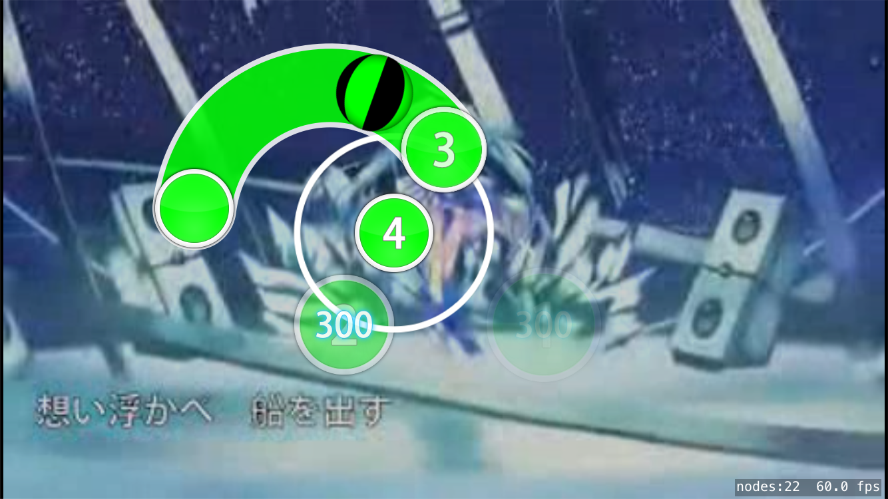

## iosu!

### Introduction
This is an ios port of the rhythm game [osu!](https://osu.ppy.sh). It is written in Swift based on [SpriteKit](https://developer.apple.com/spritekit/) framework. **It is just for fun**. So don't expect that I can make it full functional in a short time. Most importantly, I'm using a hackintosh for developing. So if it stops working, I cannot continue developing until it is fixed. Also, I don't have much time to spend on this project. But you can still watch the progress. It will be great if you can join and help me make it work.

### What has been done
 - Scan beatmaps imported by iTunes
 - Decode .osu file (partly)
 - Timing
 - Render background image & Background dim
 - Draw Plain HitCircle
 - Draw HitCircle in Slider
 - Draw straight & passthrough(arc) & bezier slider
 - **Play backgound video**
 - **Play StoryBoard**

### How to use
1. Install the latest version of XCode.
2. Compile and install this project on your device **(DO NOT USE SIMULATOR!)** .
3. Import beatmaps via iTunes(as shown below).

4. Run the application.

### Notice
1. Currently there is no database, so please do not import too many beatmaps.
2. Currently there is no handle for touch input, so what you can see is just a demo.
3. I only have an iPhone6s to test, so it may render terribly on devices with different resolutions.
4. If the framerate drops under 10, the timing will be inaccurate. So do not try to run it in the simulator. If that happens on your device, maybe you can consider update it because of low performance.
5. I have modified the SpriteKitEasingSwift framework to meet the need of osu! storyboard. The [modified version](https://github.com/imxieyi/SpriteKitEasingSwift) can also be installed by CocoaPods.
6. Now with the help of image buffer, you can load any complicated storyboard. **But be sure to correct storyboard image paths because in Unix-like system file name is case sensitive.** Also, there is still some bugs in the render and processor. But in most of the time it works well.
7. StoryBoard support for [Cheat Sheet](https://osu.ppy.sh/wiki/Storyboard_Scripting/Cheat_Sheet) is incomplete. Loading such storyboards might crash the application.
8. Both the osu game and StoryBoard player are unfinished.
9. I'm new to iOS development, Swift and SpriteKit. And I don't like to insert a lot of comments. So please tolerate my awful code.

### GamePlay Screenshot

**With background image:**

beatmap: [yuikonnu - Tsumi no Namae](https://osu.ppy.sh/s/548999)

**With background video:**

beatmap: [Hatsune Miku - SPiCa](https://osu.ppy.sh/s/16226)

### StoryBoard Screenshot

beatmap: [Tatsumi Megumi featured by Sano Hiroaki - Tsubomi (Long Version)](https://osu.ppy.sh/s/311064)

### StoryBoard Demo Videos

Notice: The following videos are outdated. If you want to see the latest version, please clone and install the latest version on your device.

[http://www.bilibili.com/video/av9580463/](http://www.bilibili.com/video/av9580463/)

[http://www.bilibili.com/video/av9582040/](http://www.bilibili.com/video/av9582040/)

[http://www.bilibili.com/video/av9582174/](http://www.bilibili.com/video/av9582174/)

[http://www.bilibili.com/video/av9582511/](http://www.bilibili.com/video/av9582511/)

### Credit
 - [osu!](https://osu.ppy.sh)
 - [osu-parser](https://github.com/nojhamster/osu-parser)
 - [SpriteKitEasingSwift](https://github.com/craiggrummitt/SpriteKitEasingSwift)
 - [KSYMediaPlayer_iOS](https://github.com/ksvc/KSYMediaPlayer_iOS)
 - [Stack Overflow](http://stackoverflow.com)
 - [Apple Developer Documentation](https://developer.apple.com/reference/)
